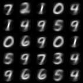
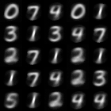
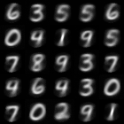
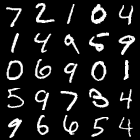
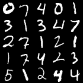
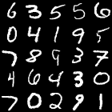

# capsule_network
胶囊神经网络
## Capsule network
I tried to implement the idea in [Dynamic Routing Between Capsules](https://arxiv.org/abs/1710.09829)

$$v_j=g(s_j)$$  
$$g(s_j)=\frac{||s_j||^2}{1+||s_j||^2} \frac{s_j}{|s_j|}$$  
$$s_j=\sum_ic_{ij} \hat u_{j|i}$$  

### Reconstruction - Raw images
    
   
